# Rental Marketplace Mobile

A Flutter mobile application for a peer-to-peer asset rental marketplace. The app supports listing creation, location-based discovery, saved items, date-range booking, PayMongo checkout, in-app chat, QR-based handover/return verification, reviews, and post-return settlement flows.

This project was developed with AI-assisted engineering workflows using OpenAI Codex, with manual implementation, debugging, architecture decisions, and Flutter/Firebase integration work.

## Screenshots

  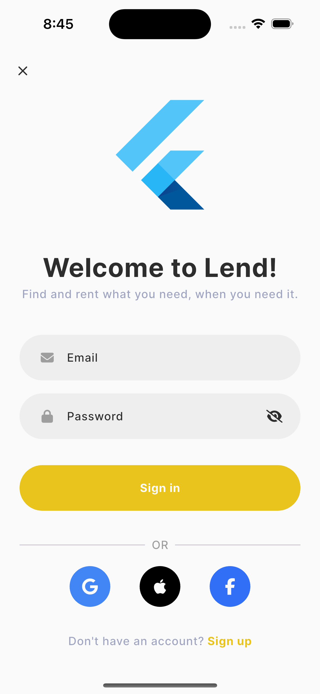
  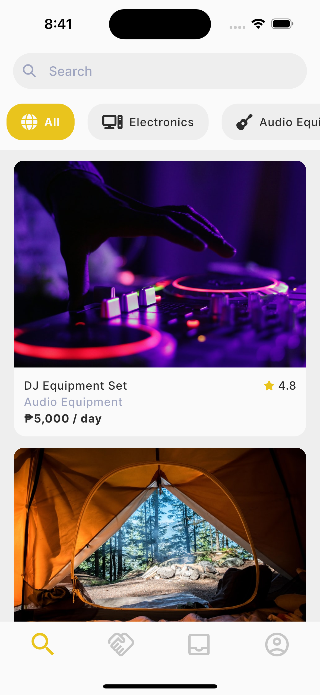
  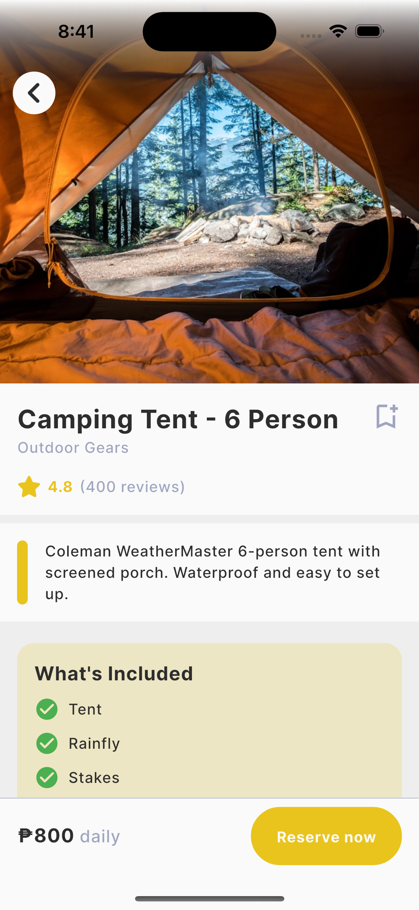

 

  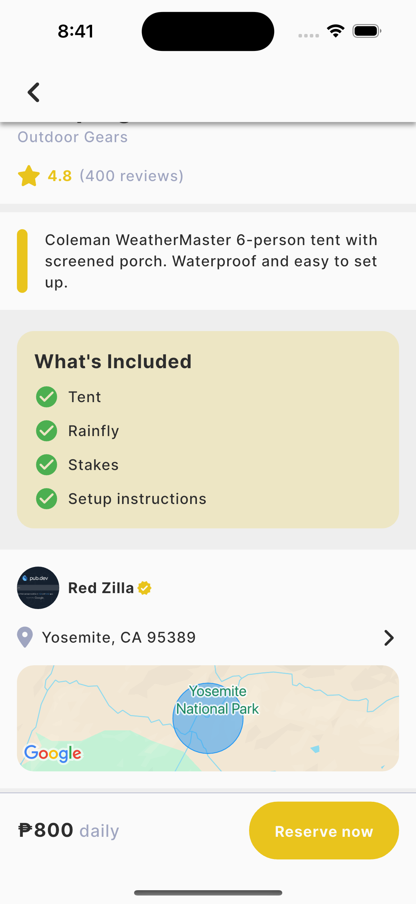
  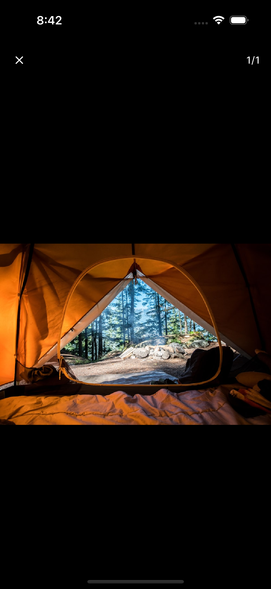
  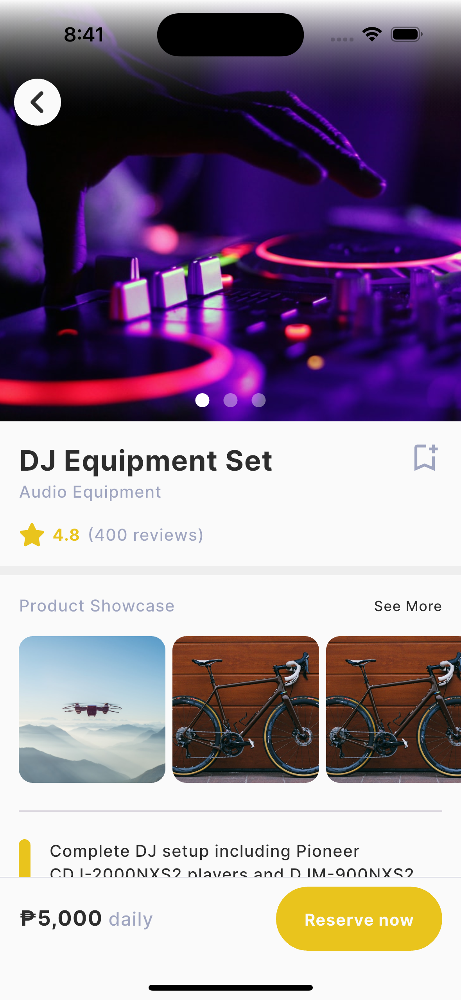

 

  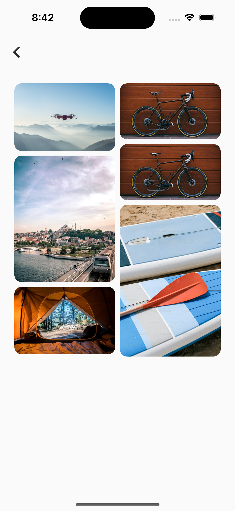
  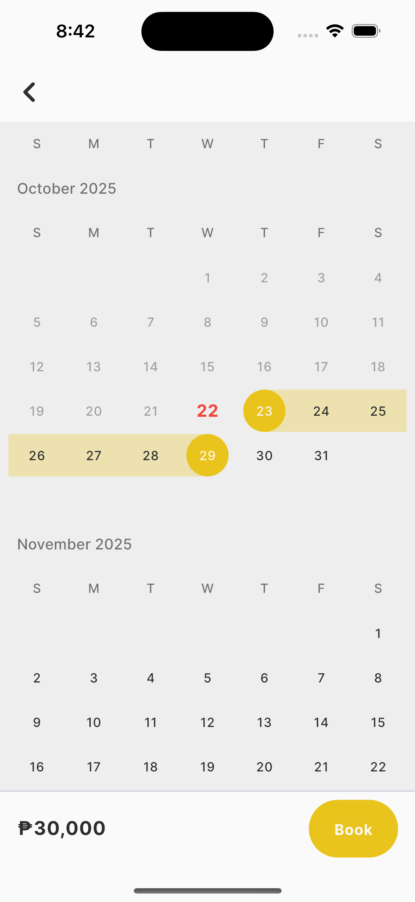
  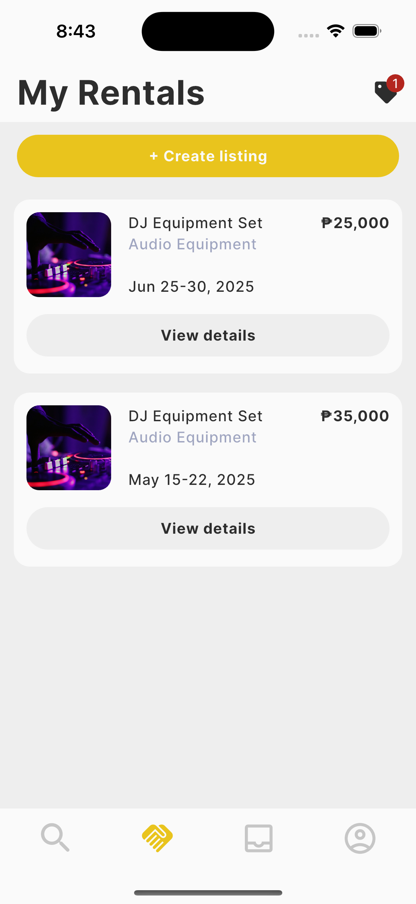

 

  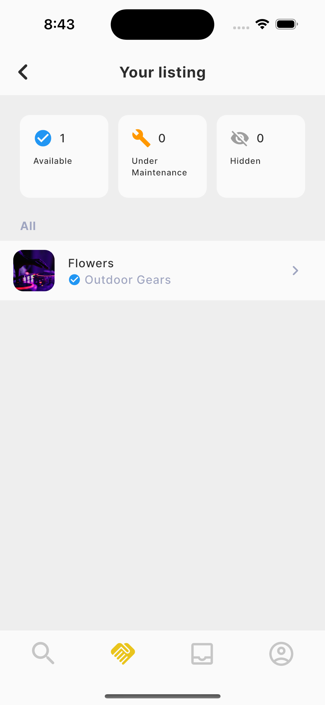
  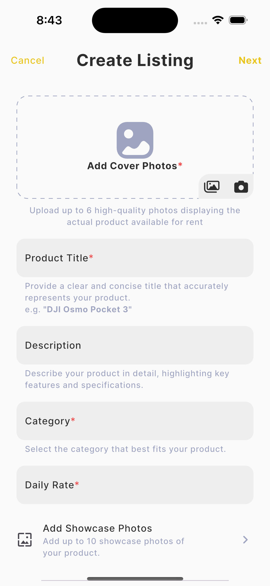
  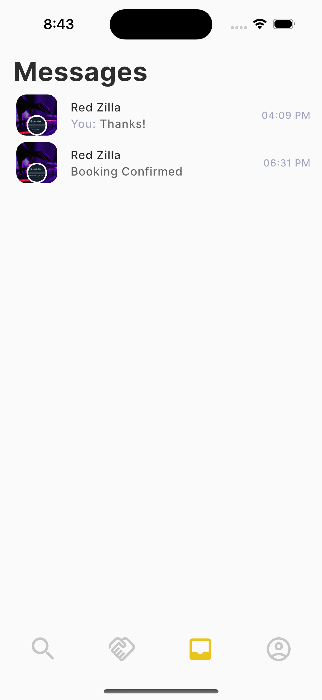

 

  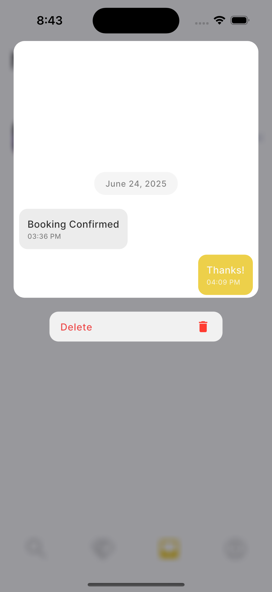
  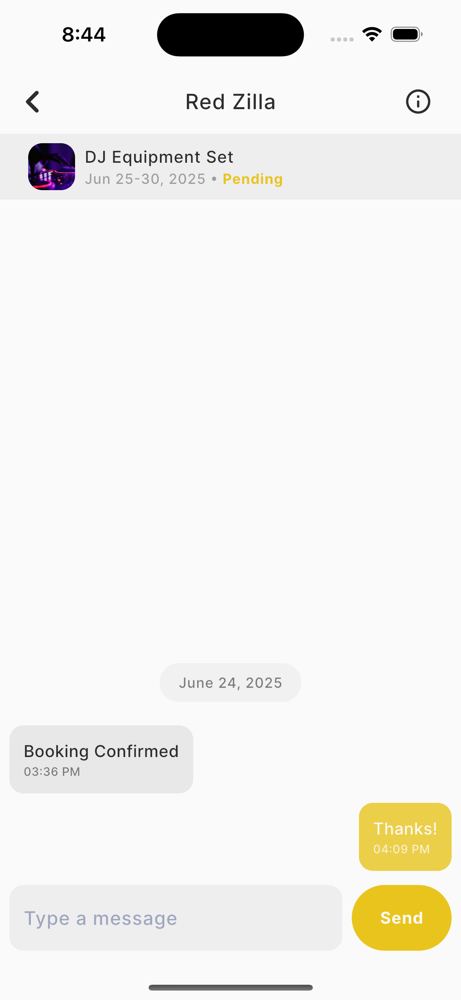
  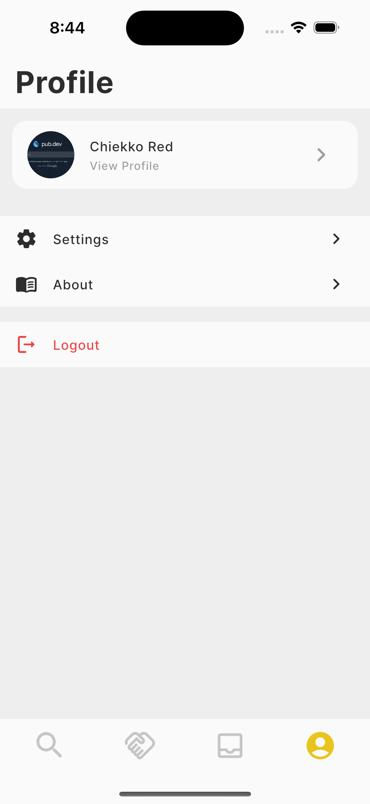

 

  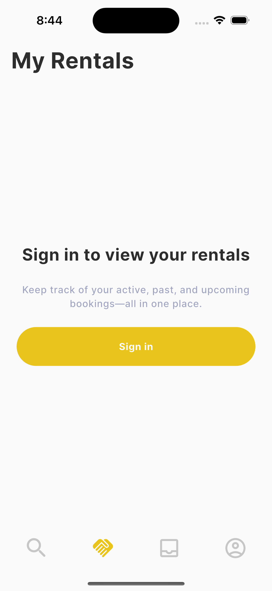
  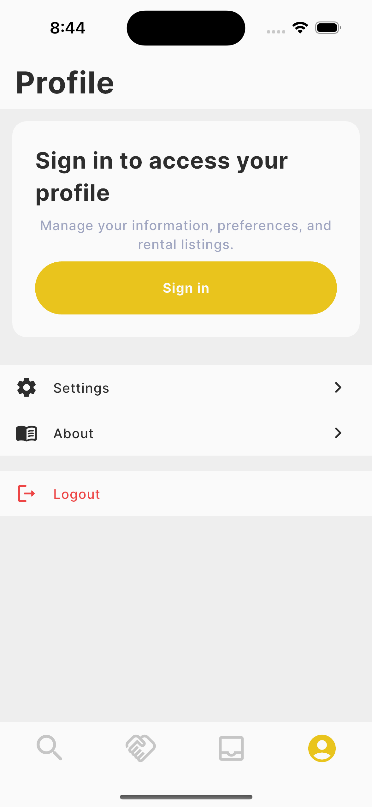

❌ Preset photos

---

## License

Lend is MIT licensed. See `LICENSE`.

---
